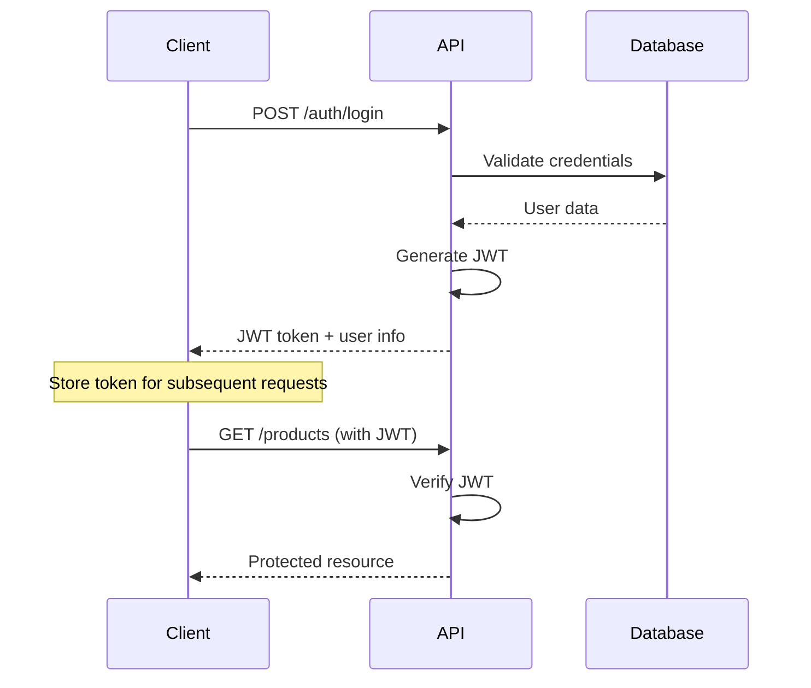
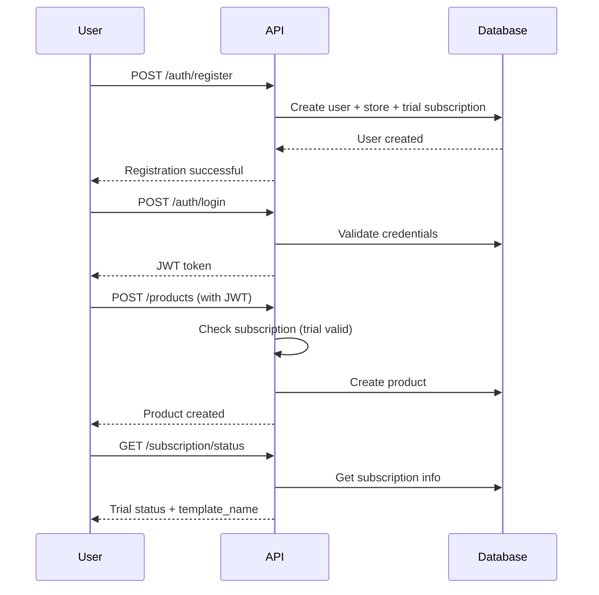
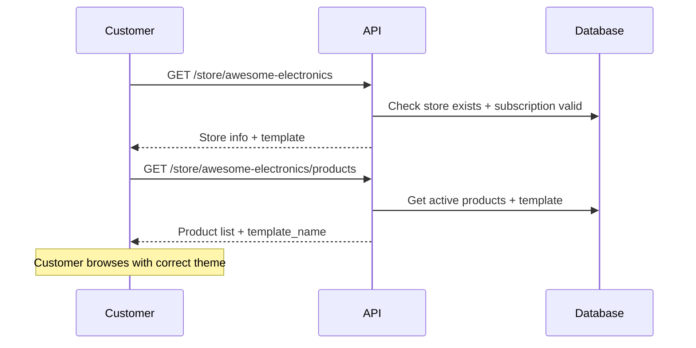

# API Documentation

This document provides comprehensive documentation for all UddoktaHut Backend API endpoints, including request/response formats, authentication requirements, and usage examples.

## 📖 Table of Contents

- [Base Information](#base-information)
- [Authentication](#authentication)
- [Error Handling](#error-handling)
- [Authentication Endpoints](#authentication-endpoints)
- [Product Management APIs](#product-management-apis)
- [Store Management APIs](#store-management-apis)
- [Subscription APIs](#subscription-apis)
- [User Management APIs](#user-management-apis)
- [Rate Limiting](#rate-limiting)
- [Postman Collection](#postman-collection)

## 🌐 Base Information

**Base URL:** `http://localhost:4000/api`  
**API Version:** v1  
**Content Type:** `application/json`  
**Authentication:** JWT Bearer Token

### Response Format

All API responses follow this standard format:

```json
{
  "success": true,
  "data": {},
  "message": "Success message",
  "timestamp": "2024-10-19T10:30:00.000Z"
}
```

## 🔐 Authentication

### JWT Token Structure

```javascript
Header: {
  "Authorization": "Bearer <jwt_token>"
}
```

### Token Payload

```json
{
  "id": 123,
  "email": "user@example.com",
  "iat": 1634567890,
  "exp": 1635172690
}
```

### Authentication Flow



## ❌ Error Handling

### Error Response Format

```json
{
  "success": false,
  "error": {
    "code": "VALIDATION_ERROR",
    "message": "Invalid input data",
    "details": {
      "field": "email",
      "issue": "Invalid email format"
    }
  },
  "timestamp": "2024-10-19T10:30:00.000Z"
}
```

### Common Error Codes

| Code                    | HTTP Status | Description                       |
| ----------------------- | ----------- | --------------------------------- |
| `VALIDATION_ERROR`      | 400         | Input validation failed           |
| `UNAUTHORIZED`          | 401         | Invalid or missing authentication |
| `FORBIDDEN`             | 403         | Insufficient permissions          |
| `NOT_FOUND`             | 404         | Resource not found                |
| `SUBSCRIPTION_REQUIRED` | 403         | No active subscription            |
| `TRIAL_EXPIRED`         | 403         | Trial period ended                |
| `SUBSCRIPTION_EXPIRED`  | 403         | Subscription expired              |
| `INTERNAL_ERROR`        | 500         | Server error                      |

## 🔑 Authentication Endpoints

### Login User

**Endpoint:** `POST /auth/login`  
**Authentication:** None required  
**Description:** Authenticate user and receive JWT token

#### Request Body

```json
{
  "email": "user@example.com",
  "password": "userpassword"
}
```

#### Response (200 OK)

```json
{
  "success": true,
  "data": {
    "token": "eyJhbGciOiJIUzI1NiIsInR5cCI6IkpXVCJ9...",
    "user": {
      "id": 123,
      "name": "John Doe",
      "email": "user@example.com",
      "onboarded": true,
      "role": 2
    }
  },
  "message": "Login successful"
}
```

#### Error Responses

```json
// 401 Unauthorized
{
  "success": false,
  "error": {
    "code": "UNAUTHORIZED",
    "message": "Invalid email or password"
  }
}
```

### Register User

**Endpoint:** `POST /auth/register`  
**Authentication:** None required  
**Description:** Create new user account

#### Request Body

```json
{
  "name": "John Doe",
  "email": "user@example.com",
  "password": "securepassword",
  "phoneNumber": "+1234567890"
}
```

#### Response (201 Created)

```json
{
  "success": true,
  "data": {
    "user": {
      "id": 123,
      "name": "John Doe",
      "email": "user@example.com",
      "phoneNumber": "+1234567890"
    }
  },
  "message": "Account created successfully"
}
```

### Get Current User

**Endpoint:** `GET /auth/me`  
**Authentication:** Required  
**Description:** Get current authenticated user information

#### Response (200 OK)

```json
{
  "success": true,
  "data": {
    "user": {
      "id": 123,
      "name": "John Doe",
      "email": "user@example.com",
      "phoneNumber": "+1234567890",
      "onboarded": true,
      "role": 2,
      "template_name": "classic",
      "isActive": true
    }
  }
}
```

## 📦 Product Management APIs

### Get Products

**Endpoint:** `GET /products`  
**Authentication:** Required  
**Description:** Get paginated list of user's products with search and filtering

#### Query Parameters

| Parameter | Type    | Default | Description                              |
| --------- | ------- | ------- | ---------------------------------------- |
| page      | integer | 1       | Page number for pagination               |
| pageSize  | integer | 10      | Number of items per page                 |
| search    | string  | ""      | Search term for name, category, or SKU   |
| sortBy    | string  | "id"    | Sort field (id, name, price, created_at) |
| sortOrder | string  | "desc"  | Sort direction (asc, desc)               |

#### Example Request

```
GET /products?page=1&pageSize=20&search=laptop&sortBy=price&sortOrder=asc
```

#### Response (200 OK)

```json
{
  "success": true,
  "data": {
    "data": [
      {
        "id": 1,
        "name": "Gaming Laptop",
        "description": "High-performance gaming laptop",
        "image": "https://example.com/laptop.jpg",
        "price": "1299.99",
        "stock": 15,
        "status": "Active",
        "category": "Electronics",
        "sku": "LAPTOP-001",
        "created_at": "2024-10-19T10:00:00.000Z",
        "updated_at": "2024-10-19T10:00:00.000Z"
      }
    ],
    "total": 25,
    "page": 1,
    "pageSize": 20
  }
}
```

### Create Product

**Endpoint:** `POST /products`  
**Authentication:** Required + Active Subscription  
**Description:** Create a new product in user's store

#### Request Body

```json
{
  "name": "Gaming Laptop",
  "description": "High-performance gaming laptop with RTX 4080",
  "image": "https://example.com/laptop.jpg",
  "price": 1299.99,
  "stock": 15,
  "category": "Electronics",
  "sku": "LAPTOP-001"
}
```

#### Validation Rules

- `name`: Required, 1-255 characters
- `description`: Optional, max 1000 characters
- `image`: Optional, valid URL format
- `price`: Required, positive decimal
- `stock`: Optional, non-negative integer
- `category`: Optional, max 100 characters
- `sku`: Required, unique across all products

#### Response (201 Created)

```json
{
  "success": true,
  "data": {
    "product": {
      "id": 123,
      "name": "Gaming Laptop",
      "description": "High-performance gaming laptop with RTX 4080",
      "image": "https://example.com/laptop.jpg",
      "price": "1299.99",
      "stock": 15,
      "status": "Active",
      "category": "Electronics",
      "sku": "LAPTOP-001",
      "store_id": 5,
      "created_at": "2024-10-19T10:30:00.000Z",
      "updated_at": "2024-10-19T10:30:00.000Z"
    }
  },
  "message": "Product created successfully"
}
```

### Update Product

**Endpoint:** `PATCH /products/:id`  
**Authentication:** Required + Active Subscription  
**Description:** Update existing product (only owner can update)

#### Request Body (Partial Update)

```json
{
  "name": "Updated Gaming Laptop",
  "price": 1199.99,
  "stock": 20
}
```

#### Response (200 OK)

```json
{
  "success": true,
  "data": {
    "product": {
      "id": 123,
      "name": "Updated Gaming Laptop",
      "price": "1199.99",
      "stock": 20,
      "updated_at": "2024-10-19T11:00:00.000Z"
    }
  },
  "message": "Product updated successfully"
}
```

### Delete Product

**Endpoint:** `DELETE /products/:id`  
**Authentication:** Required + Active Subscription  
**Description:** Delete product (only owner can delete)

#### Response (200 OK)

```json
{
  "success": true,
  "message": "Product deleted successfully"
}
```

## 🏪 Store Management APIs

### Get Public Store Info

**Endpoint:** `GET /store/:storeName`  
**Authentication:** None required  
**Description:** Get public store information by store name

#### Example Request

```
GET /store/awesome-electronics
```

#### Response (200 OK)

```json
{
  "success": true,
  "data": {
    "store_name": "awesome-electronics",
    "template_name": "classic",
    "store_type": "ecommerce"
  }
}
```

### Get Public Store Products

**Endpoint:** `GET /store/:storeName/products`  
**Authentication:** None required (but store must have active subscription)  
**Description:** Get public product listing for a store

#### Query Parameters

Same as private product listing: `page`, `pageSize`, `search`, `sortBy`, `sortOrder`

#### Example Request

```
GET /store/awesome-electronics/products?page=1&pageSize=12&search=laptop
```

#### Response (200 OK)

```json
{
  "success": true,
  "data": {
    "data": [
      {
        "id": 1,
        "name": "Gaming Laptop",
        "image": "https://example.com/laptop.jpg",
        "price": "1299.99",
        "stock": 15,
        "status": "Active",
        "category": "Electronics",
        "sku": "LAPTOP-001"
      }
    ],
    "total": 25,
    "page": 1,
    "pageSize": 12,
    "templateName": "classic"
  }
}
```

### Update Store Template

**Endpoint:** `PATCH /store/:storeName/template`  
**Authentication:** Required + Active Subscription  
**Description:** Update store's frontend template (only store owner)

#### Request Body

```json
{
  "templateName": "modern"
}
```

#### Response (200 OK)

```json
{
  "success": true,
  "data": {
    "store": {
      "id": 5,
      "store_name": "awesome-electronics",
      "template_name": "modern",
      "store_type": "ecommerce",
      "updated_at": "2024-10-19T11:30:00.000Z"
    }
  },
  "message": "Store template updated successfully"
}
```

## 💳 Subscription APIs

### Get Subscription Status

**Endpoint:** `GET /subscription/status`  
**Authentication:** Required  
**Description:** Get current user's subscription status and store information

#### Response (200 OK)

```json
{
  "success": true,
  "data": {
    "user": {
      "name": "John Doe",
      "email": "user@example.com",
      "phoneNumber": "+1234567890",
      "onboarded": true,
      "role": 2,
      "template_name": "classic",
      "isActive": true
    }
  }
}
```

#### Response for User Without Store

```json
{
  "success": true,
  "data": {
    "user": {
      "name": "John Doe",
      "email": "user@example.com",
      "phoneNumber": "+1234567890",
      "onboarded": false,
      "role": 1
    }
  }
}
```

## 👥 User Management APIs

### Get All Users (Admin Only)

**Endpoint:** `GET /users`  
**Authentication:** Required + Admin Role  
**Description:** Get paginated list of all users

#### Query Parameters

| Parameter | Type    | Default | Description             |
| --------- | ------- | ------- | ----------------------- |
| page      | integer | 1       | Page number             |
| pageSize  | integer | 10      | Items per page          |
| search    | string  | ""      | Search by name or email |

#### Response (200 OK)

```json
{
  "success": true,
  "data": {
    "data": [
      {
        "id": 123,
        "name": "John Doe",
        "email": "user@example.com",
        "phoneNumber": "+1234567890",
        "onboarded": true,
        "role": "store_owner",
        "created_at": "2024-10-19T09:00:00.000Z"
      }
    ],
    "total": 150,
    "page": 1,
    "pageSize": 10
  }
}
```

## 🚦 API Flow Examples

### Complete Store Setup Flow



### Customer Browse Store Flow



## 🔒 Middleware Chain

### Protected Endpoint Middleware Stack

```
Request → CORS → Helmet → Auth → Subscription → Validation → Controller
```

#### Middleware Functions

1. **Authentication Middleware** - Verify JWT token
2. **Subscription Middleware** - Check active subscription/trial
3. **Validation Middleware** - Validate request data with Zod
4. **Error Handler** - Centralized error response formatting

## 📊 Rate Limiting

### Default Limits

| Endpoint Category   | Requests | Time Window |
| ------------------- | -------- | ----------- |
| Authentication      | 5        | 15 minutes  |
| Product Creation    | 100      | 1 hour      |
| Product Updates     | 200      | 1 hour      |
| Public Store Access | 1000     | 1 hour      |

### Rate Limit Headers

```
X-RateLimit-Limit: 100
X-RateLimit-Remaining: 95
X-RateLimit-Reset: 1634567890
```

## 📋 Postman Collection

### Environment Variables

```json
{
  "base_url": "http://localhost:4000/api",
  "jwt_token": "{{auth_token}}",
  "store_name": "awesome-electronics"
}
```

### Collection Structure

```
UddoktaHut API/
├── Authentication/
│   ├── Register User
│   ├── Login User
│   └── Get Current User
├── Products/
│   ├── Get Products
│   ├── Create Product
│   ├── Update Product
│   └── Delete Product
├── Store/
│   ├── Get Store Info
│   ├── Get Store Products
│   └── Update Template
└── Subscription/
    └── Get Status
```

## 🧪 Testing Examples

### cURL Examples

#### Register User

```bash
curl -X POST http://localhost:4000/api/auth/register \
  -H "Content-Type: application/json" \
  -d '{
    "name": "John Doe",
    "email": "john@example.com",
    "password": "securepassword"
  }'
```

#### Create Product

```bash
curl -X POST http://localhost:4000/api/products \
  -H "Content-Type: application/json" \
  -H "Authorization: Bearer YOUR_JWT_TOKEN" \
  -d '{
    "name": "Gaming Laptop",
    "price": 1299.99,
    "stock": 15,
    "category": "Electronics",
    "sku": "LAPTOP-001"
  }'
```

#### Get Store Products

```bash
curl -X GET "http://localhost:4000/api/store/awesome-electronics/products?page=1&pageSize=10" \
  -H "Content-Type: application/json"
```

---

This API documentation provides comprehensive coverage of all endpoints with request/response examples and usage patterns for building client applications.
