# System Architecture

This document provides a comprehensive overview of the UddoktaHut Backend architecture, design patterns, and system components.

## 📐 High-Level Architecture

UddoktaHut Backend follows a **Multi-Tenant SaaS Architecture** with subscription-based access control and role-based permissions.

### Architecture Diagram

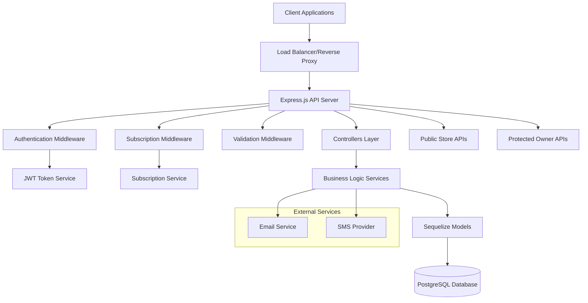

## 🏢 Multi-Tenant Architecture

### Tenant Isolation Strategy

The system implements **Row-Level Security (RLS)** for multi-tenancy:

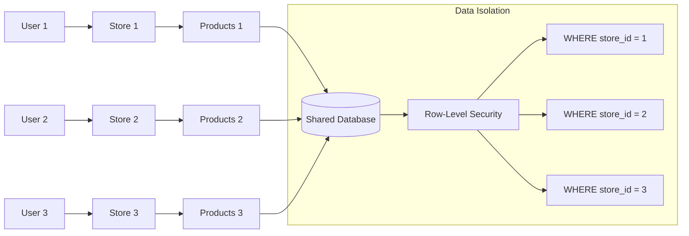

### Tenant Data Flow

1. **User Authentication** → JWT contains user_id
2. **Store Resolution** → Query store by user_id
3. **Data Filtering** → All queries filtered by store_id
4. **Response** → Only tenant's data returned

## 🔧 Component Architecture

### Layered Architecture Pattern

```
┌─────────────────────────────────┐
│         Presentation Layer       │
│    (Routes, Controllers, MW)     │
├─────────────────────────────────┤
│        Business Logic Layer      │
│         (Services)              │
├─────────────────────────────────┤
│        Data Access Layer        │
│    (Models, Repositories)       │
├─────────────────────────────────┤
│        Database Layer           │
│     (PostgreSQL, Sequelize)     │
└─────────────────────────────────┘
```

### Component Responsibilities

#### 1. **Presentation Layer**

- **Routes** - HTTP endpoint definitions
- **Controllers** - Request/response handling
- **Middleware** - Authentication, validation, subscription checks

#### 2. **Business Logic Layer**

- **Services** - Core business logic
- **Validators** - Input validation with Zod
- **Utilities** - Helper functions and constants

#### 3. **Data Access Layer**

- **Models** - Sequelize ORM models
- **Migrations** - Database schema versioning
- **Seeders** - Initial data population

## 🔐 Security Architecture

### Authentication Flow

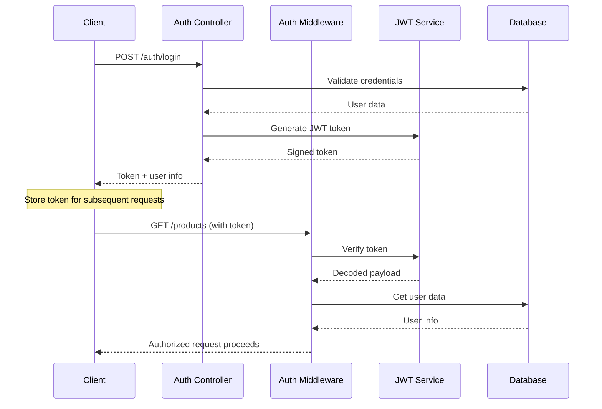

### Authorization Layers

1. **JWT Authentication** - Verify token validity
2. **Role-Based Access** - Check user roles
3. **Subscription Validation** - Verify active subscription
4. **Resource Ownership** - Ensure data belongs to user's store

## 💳 Subscription Architecture

### Subscription State Management

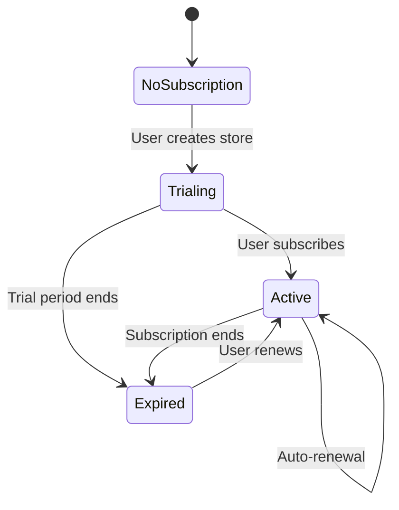

### Subscription Middleware Flow

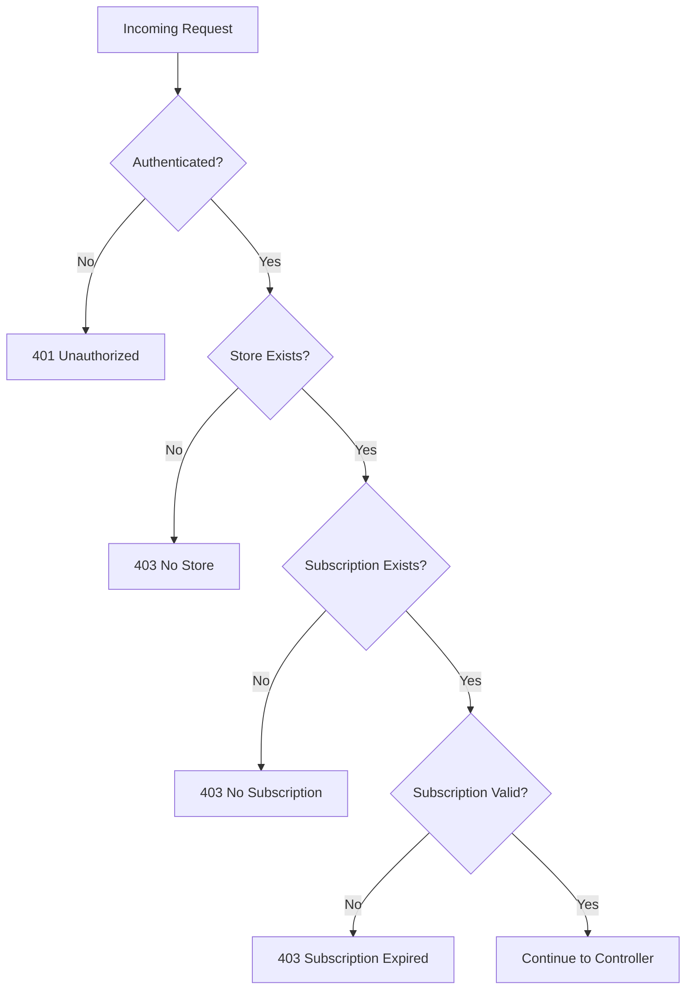

## 📊 Data Flow Architecture

### Product Management Flow

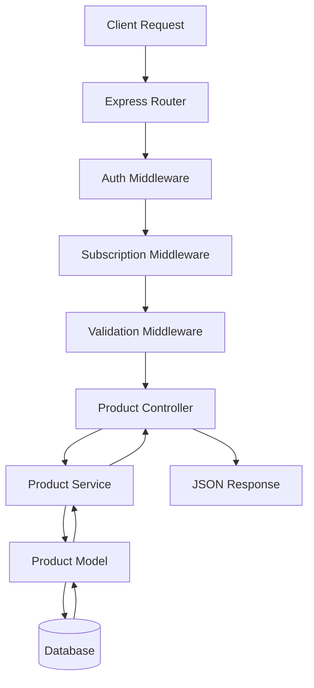

### Public Store Access Flow

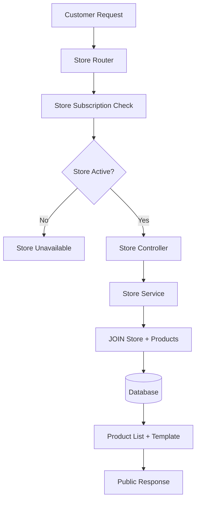

## 🗄️ Database Architecture

### Entity Relationship Design

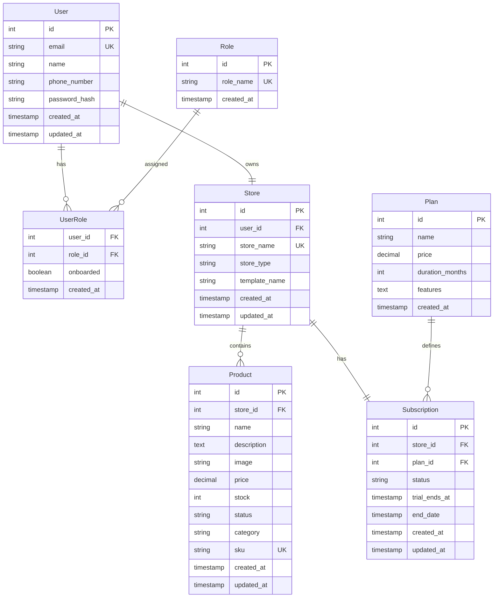

## 🚀 Performance Architecture

### Optimization Strategies

#### 1. **Database Optimization**

- **Indexes** on frequently queried columns
- **JOIN optimization** for related data
- **Query batching** for bulk operations
- **Connection pooling** for concurrent requests

#### 2. **Caching Strategy**

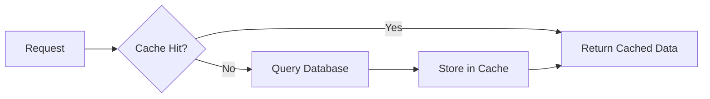

#### 3. **Pagination Implementation**

- **Limit/Offset** for simple pagination
- **Cursor-based** for large datasets
- **Search optimization** with full-text indexes

## 🔄 API Architecture

### RESTful Design Principles

#### Resource-Based URLs

- `/api/products` - Product collection
- `/api/products/:id` - Specific product
- `/api/store/:storeName` - Store resource
- `/api/subscription/status` - Subscription state

#### HTTP Method Usage

- `GET` - Read operations (no subscription check)
- `POST` - Create operations (subscription required)
- `PATCH` - Update operations (subscription required)
- `DELETE` - Delete operations (subscription required)

### API Middleware Stack

```
Request → CORS → Helmet → Auth → Subscription → Validation → Controller
```

## 📦 Deployment Architecture

### Environment Structure

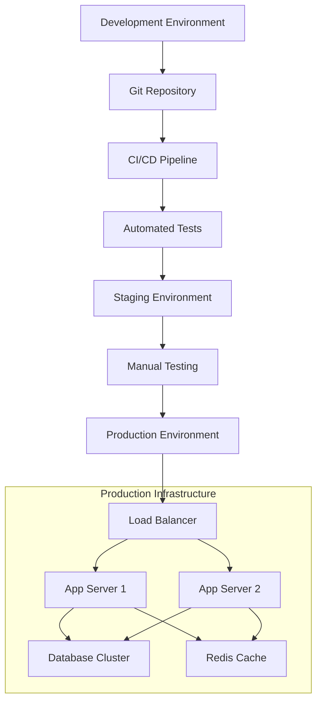

## 🛡️ Error Handling Architecture

### Centralized Error Management

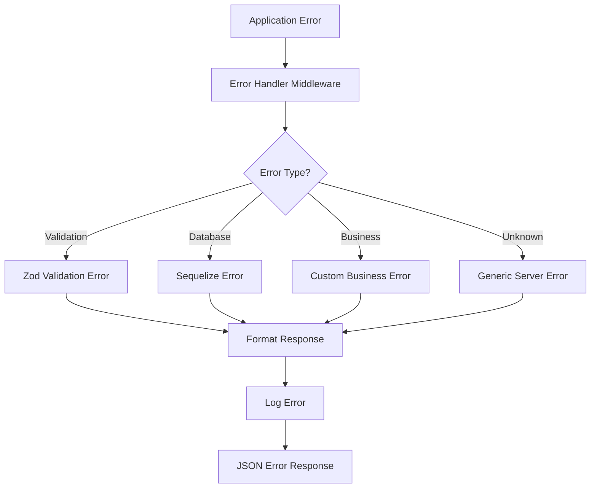

## 📈 Scalability Considerations

### Horizontal Scaling

- **Stateless API design** - No server-side sessions
- **Database connection pooling** - Shared connections
- **Load balancing** - Distribute requests across instances

### Vertical Scaling

- **Database optimization** - Efficient queries and indexes
- **Memory management** - Proper garbage collection
- **CPU utilization** - Async/await patterns

### Future Enhancements

- **Microservices architecture** - Service decomposition
- **Event-driven architecture** - Async communication
- **CQRS pattern** - Command/Query separation

## 🔍 Monitoring & Observability

### Logging Strategy

- **Structured logging** with JSON format
- **Request/response logging** for debugging
- **Error tracking** with stack traces
- **Performance metrics** for optimization

### Health Checks

- **Database connectivity** checks
- **External service** availability
- **Memory/CPU usage** monitoring
- **Response time** tracking

---

This architecture provides a solid foundation for a scalable, secure, and maintainable multi-tenant SaaS application.
