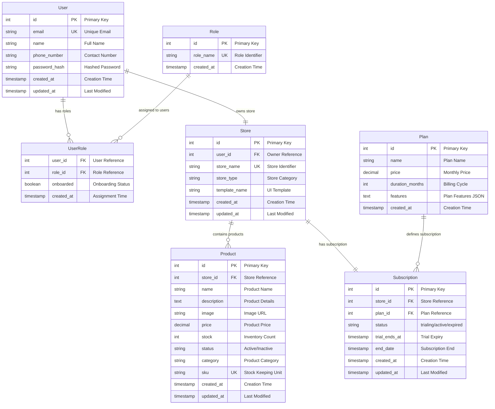
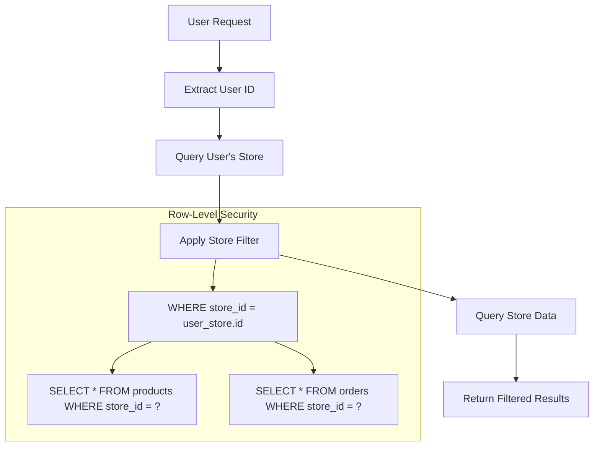
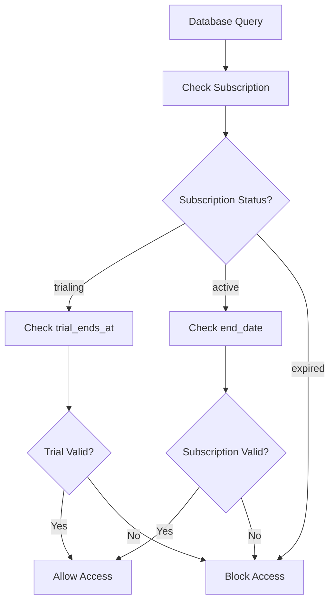

# Database Schema Documentation

This document provides comprehensive documentation of the UddoktaHut Backend database schema, including models, relationships, indexes, and data flow patterns.

## 🗄️ Database Overview

**Database Type:** PostgreSQL  
**ORM:** Sequelize  
**Architecture:** Multi-tenant with Row-Level Security  
**Migration Strategy:** Version-controlled schema changes

## 📊 Entity Relationship Diagram



## 📋 Model Specifications

### User Model

**Table:** `users`  
**Purpose:** User account management and authentication

| Column        | Type         | Constraints                 | Description            |
| ------------- | ------------ | --------------------------- | ---------------------- |
| id            | INTEGER      | PRIMARY KEY, AUTO_INCREMENT | Unique user identifier |
| name          | VARCHAR(255) | NOT NULL                    | User's full name       |
| email         | VARCHAR(255) | NOT NULL, UNIQUE            | Login email address    |
| phone_number  | VARCHAR(20)  | NULLABLE                    | Contact phone number   |
| password_hash | VARCHAR(255) | NOT NULL                    | Bcrypt hashed password |
| created_at    | TIMESTAMP    | NOT NULL                    | Account creation time  |
| updated_at    | TIMESTAMP    | NOT NULL                    | Last profile update    |

**Indexes:**

- PRIMARY KEY on `id`
- UNIQUE INDEX on `email`
- INDEX on `created_at`

### Role Model

**Table:** `roles`  
**Purpose:** Role definitions for access control

| Column     | Type        | Constraints                 | Description                                    |
| ---------- | ----------- | --------------------------- | ---------------------------------------------- |
| id         | INTEGER     | PRIMARY KEY, AUTO_INCREMENT | Unique role identifier                         |
| role_name  | VARCHAR(50) | NOT NULL, UNIQUE            | Role identifier (admin, store_owner, customer) |
| created_at | TIMESTAMP   | NOT NULL                    | Role creation time                             |

**Indexes:**

- PRIMARY KEY on `id`
- UNIQUE INDEX on `role_name`

**Default Roles:**

- `admin` - System administrator
- `store_owner` - Store owner/manager
- `customer` - Regular customer

### UserRole Model

**Table:** `user_roles`  
**Purpose:** Many-to-many relationship between users and roles

| Column     | Type      | Constraints           | Description                |
| ---------- | --------- | --------------------- | -------------------------- |
| user_id    | INTEGER   | FOREIGN KEY, NOT NULL | Reference to users.id      |
| role_id    | INTEGER   | FOREIGN KEY, NOT NULL | Reference to roles.id      |
| onboarded  | BOOLEAN   | DEFAULT false         | User onboarding completion |
| created_at | TIMESTAMP | NOT NULL              | Role assignment time       |

**Indexes:**

- COMPOSITE PRIMARY KEY on `(user_id, role_id)`
- FOREIGN KEY on `user_id` → `users.id`
- FOREIGN KEY on `role_id` → `roles.id`

### Store Model

**Table:** `stores`  
**Purpose:** Multi-tenant store instances

| Column        | Type         | Constraints                 | Description                   |
| ------------- | ------------ | --------------------------- | ----------------------------- |
| id            | INTEGER      | PRIMARY KEY, AUTO_INCREMENT | Unique store identifier       |
| user_id       | INTEGER      | FOREIGN KEY, NOT NULL       | Store owner reference         |
| store_name    | VARCHAR(255) | NOT NULL, UNIQUE            | URL-friendly store identifier |
| store_type    | VARCHAR(100) | DEFAULT 'ecommerce'         | Store category/type           |
| template_name | VARCHAR(100) | DEFAULT 'classic'           | Frontend template identifier  |
| created_at    | TIMESTAMP    | NOT NULL                    | Store creation time           |
| updated_at    | TIMESTAMP    | NOT NULL                    | Last store update             |

**Indexes:**

- PRIMARY KEY on `id`
- UNIQUE INDEX on `store_name`
- FOREIGN KEY on `user_id` → `users.id`
- INDEX on `template_name`

### Product Model

**Table:** `products`  
**Purpose:** Store inventory management

| Column      | Type          | Constraints                 | Description               |
| ----------- | ------------- | --------------------------- | ------------------------- |
| id          | INTEGER       | PRIMARY KEY, AUTO_INCREMENT | Unique product identifier |
| store_id    | INTEGER       | FOREIGN KEY, NOT NULL       | Store reference           |
| name        | VARCHAR(255)  | NOT NULL                    | Product name              |
| description | TEXT          | NULLABLE                    | Product description       |
| image       | VARCHAR(500)  | NULLABLE                    | Product image URL         |
| price       | DECIMAL(10,2) | NOT NULL                    | Product price             |
| stock       | INTEGER       | DEFAULT 0                   | Inventory quantity        |
| status      | VARCHAR(20)   | DEFAULT 'Active'            | Product status            |
| category    | VARCHAR(100)  | NULLABLE                    | Product category          |
| sku         | VARCHAR(100)  | UNIQUE                      | Stock Keeping Unit        |
| created_at  | TIMESTAMP     | NOT NULL                    | Product creation time     |
| updated_at  | TIMESTAMP     | NOT NULL                    | Last product update       |

**Indexes:**

- PRIMARY KEY on `id`
- FOREIGN KEY on `store_id` → `stores.id`
- UNIQUE INDEX on `sku`
- INDEX on `name` (for search)
- INDEX on `category` (for filtering)
- INDEX on `status` (for active products)
- COMPOSITE INDEX on `(store_id, status)` (for store products)

### Subscription Model

**Table:** `subscriptions`  
**Purpose:** Subscription and trial management

| Column        | Type        | Constraints                 | Description                    |
| ------------- | ----------- | --------------------------- | ------------------------------ |
| id            | INTEGER     | PRIMARY KEY, AUTO_INCREMENT | Unique subscription identifier |
| store_id      | INTEGER     | FOREIGN KEY, NOT NULL       | Store reference                |
| plan_id       | INTEGER     | FOREIGN KEY, NOT NULL       | Plan reference                 |
| status        | VARCHAR(20) | DEFAULT 'trialing'          | Subscription status            |
| trial_ends_at | TIMESTAMP   | NULLABLE                    | Trial expiration time          |
| end_date      | TIMESTAMP   | NULLABLE                    | Subscription end date          |
| created_at    | TIMESTAMP   | NOT NULL                    | Subscription start time        |
| updated_at    | TIMESTAMP   | NOT NULL                    | Last status update             |

**Indexes:**

- PRIMARY KEY on `id`
- FOREIGN KEY on `store_id` → `stores.id`
- FOREIGN KEY on `plan_id` → `plans.id`
- INDEX on `status`
- INDEX on `trial_ends_at`
- INDEX on `end_date`

**Status Values:**

- `trialing` - Active trial period
- `active` - Paid subscription active
- `expired` - Subscription/trial ended

### Plan Model

**Table:** `plans`  
**Purpose:** Subscription plan definitions

| Column          | Type          | Constraints                 | Description                |
| --------------- | ------------- | --------------------------- | -------------------------- |
| id              | INTEGER       | PRIMARY KEY, AUTO_INCREMENT | Unique plan identifier     |
| name            | VARCHAR(100)  | NOT NULL                    | Plan display name          |
| price           | DECIMAL(10,2) | NOT NULL                    | Monthly subscription price |
| duration_months | INTEGER       | DEFAULT 1                   | Billing cycle length       |
| features        | TEXT          | NULLABLE                    | Plan features as JSON      |
| created_at      | TIMESTAMP     | NOT NULL                    | Plan creation time         |

**Indexes:**

- PRIMARY KEY on `id`
- INDEX on `price`

## 🔗 Relationships and Constraints

### One-to-One Relationships

- **User → Store**: Each user owns exactly one store
- **Store → Subscription**: Each store has exactly one active subscription

### One-to-Many Relationships

- **Store → Products**: Each store contains multiple products
- **Plan → Subscriptions**: Each plan can have multiple subscriptions
- **Role → UserRoles**: Each role can be assigned to multiple users
- **User → UserRoles**: Each user can have multiple roles

### Many-to-Many Relationships

- **User ↔ Role**: Through UserRole junction table with onboarding status

## 🗂️ Database Indexes

### Performance Optimization Indexes

```sql
-- Search optimization
CREATE INDEX idx_products_name_search ON products USING gin(to_tsvector('english', name));
CREATE INDEX idx_products_category_search ON products USING gin(to_tsvector('english', category));

-- Multi-tenant queries
CREATE INDEX idx_products_store_status ON products(store_id, status);
CREATE INDEX idx_subscription_store_status ON subscriptions(store_id, status);

-- Time-based queries
CREATE INDEX idx_subscription_trial_ends ON subscriptions(trial_ends_at) WHERE status = 'trialing';
CREATE INDEX idx_subscription_end_date ON subscriptions(end_date) WHERE status = 'active';

-- Lookup optimization
CREATE INDEX idx_stores_name_template ON stores(store_name, template_name);
CREATE INDEX idx_users_email_created ON users(email, created_at);
```

## 📈 Data Flow Patterns

### Multi-Tenant Data Access



### Subscription Validation Flow



## 🔄 Migration Strategy

### Migration Files Structure

```
migrations/
├── 20241001000000-create-users.cjs
├── 20241001000001-create-roles.cjs
├── 20241001000002-create-user-roles.cjs
├── 20241001000003-create-stores.cjs
├── 20241001000004-create-plans.cjs
├── 20241001000005-create-subscriptions.cjs
├── 20241001000006-create-products.cjs
├── 20241007000000-add-product-search-indexes.cjs
└── 20251013000000-add-template-name-to-stores.cjs
```

### Migration Best Practices

1. **Incremental Changes**: Each migration performs single logical change
2. **Rollback Support**: All migrations include `up` and `down` methods
3. **Data Safety**: Use transactions for complex migrations
4. **Index Creation**: Add indexes in separate migrations for performance

### Example Migration

```javascript
"use strict";

module.exports = {
  async up(queryInterface, Sequelize) {
    await queryInterface.createTable("products", {
      id: {
        allowNull: false,
        autoIncrement: true,
        primaryKey: true,
        type: Sequelize.INTEGER,
      },
      store_id: {
        type: Sequelize.INTEGER,
        allowNull: false,
        references: {
          model: "stores",
          key: "id",
        },
        onUpdate: "CASCADE",
        onDelete: "CASCADE",
      },
      name: {
        type: Sequelize.STRING,
        allowNull: false,
      },
      // ... other fields
      created_at: {
        allowNull: false,
        type: Sequelize.DATE,
      },
      updated_at: {
        allowNull: false,
        type: Sequelize.DATE,
      },
    });

    // Add indexes
    await queryInterface.addIndex("products", ["store_id", "status"]);
    await queryInterface.addIndex("products", ["name"]);
  },

  async down(queryInterface, Sequelize) {
    await queryInterface.dropTable("products");
  },
};
```

## 🌱 Seeders

### Initial Data Population

```
seeders/
└── 20250411125346-role-seed.cjs
```

### Role Seeder Example

```javascript
"use strict";

module.exports = {
  async up(queryInterface, Sequelize) {
    const roles = [
      { role_name: "admin", created_at: new Date() },
      { role_name: "store_owner", created_at: new Date() },
      { role_name: "customer", created_at: new Date() },
    ];

    await queryInterface.bulkInsert("roles", roles, {
      updateOnDuplicate: ["role_name"],
    });
  },

  async down(queryInterface, Sequelize) {
    await queryInterface.bulkDelete("roles", null, {});
  },
};
```

## 🔍 Query Patterns

### Common Query Examples

#### Get Store Products with Template

```javascript
const products = await Product.findAll({
  include: [
    {
      model: Store,
      where: { store_name: "my-store" },
      attributes: ["template_name"],
    },
  ],
  where: { status: "Active" },
});
```

#### Check Subscription Status

```javascript
const subscription = await Subscription.findOne({
  include: [
    {
      model: Store,
      where: { user_id: userId },
    },
  ],
  include: [Plan],
});
```

#### Multi-tenant Product Search

```javascript
const products = await Product.findAll({
  where: {
    store_id: userStoreId,
    status: "Active",
    [Op.or]: [
      { name: { [Op.iLike]: `%${search}%` } },
      { category: { [Op.iLike]: `%${search}%` } },
    ],
  },
  order: [["created_at", "DESC"]],
  limit: pageSize,
  offset: (page - 1) * pageSize,
});
```

## ⚡ Performance Considerations

### Query Optimization

- **Use indexes** for frequently filtered columns
- **Limit SELECT fields** to reduce data transfer
- **Use JOINs efficiently** to reduce query count
- **Implement pagination** for large result sets

### Connection Management

- **Connection pooling** for concurrent requests
- **Transaction management** for data consistency
- **Query timeout** configuration for reliability

### Monitoring Queries

- **Slow query logging** for optimization
- **Query plan analysis** for bottlenecks
- **Index usage statistics** for tuning

---

This database schema provides a solid foundation for a scalable multi-tenant SaaS application with proper data isolation and performance optimization.
