# System Diagrams & Visual Documentation

This document contains comprehensive visual diagrams for the UddoktaHut Backend system architecture, database relationships, API flows, and deployment patterns.

## 📋 Table of Contents

- [System Overview Diagram](#system-overview-diagram)
- [Database Entity Relationship Diagrams](#database-entity-relationship-diagrams)
- [API Flow Diagrams](#api-flow-diagrams)
- [Authentication Flow](#authentication-flow)
- [Subscription System Flows](#subscription-system-flows)
- [Multi-Tenant Architecture](#multi-tenant-architecture)
- [Deployment Architectures](#deployment-architectures)
- [Data Flow Patterns](#data-flow-patterns)
- [Error Handling Flows](#error-handling-flows)

## 🏗️ System Overview Diagram

### High-Level System Architecture

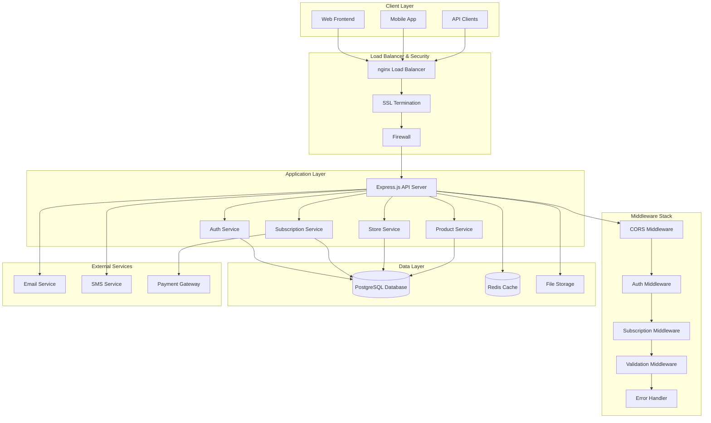
```mermaid
graph TB
    subgraph "Client Layer"
        Web[Web Frontend]
        Mobile[Mobile App]
        API_Client[API Clients]
    end

    subgraph "Load Balancer & Security"
        LB[nginx Load Balancer]
        SSL[SSL Termination]
        FW[Firewall]
    end

    subgraph "Application Layer"
        API[Express.js API Server]
        Auth[Auth Service]
        Sub[Subscription Service]
        Store[Store Service]
        Prod[Product Service]
    end

    subgraph "Middleware Stack"
        CORS[CORS Middleware]
        AuthMW[Auth Middleware]
        SubMW[Subscription Middleware]
        ValMW[Validation Middleware]
        ErrMW[Error Handler]
    end

    subgraph "Data Layer"
        DB[(PostgreSQL Database)]
        Cache[(Redis Cache)]
        Files[File Storage]
    end

    subgraph "External Services"
        Email[Email Service]
        SMS[SMS Service]
        Payment[Payment Gateway]
    end

    Web --> LB
    Mobile --> LB
    API_Client --> LB

    LB --> SSL
    SSL --> FW
    FW --> API

    API --> CORS
    CORS --> AuthMW
    AuthMW --> SubMW
    SubMW --> ValMW
    ValMW --> ErrMW

    API --> Auth
    API --> Sub
    API --> Store
    API --> Prod

    Auth --> DB
    Sub --> DB
    Store --> DB
    Prod --> DB

    API --> Cache
    API --> Files

    API --> Email
    API --> SMS
    Sub --> Payment
```

## 🗄️ Database Entity Relationship Diagrams

### Complete Database Schema

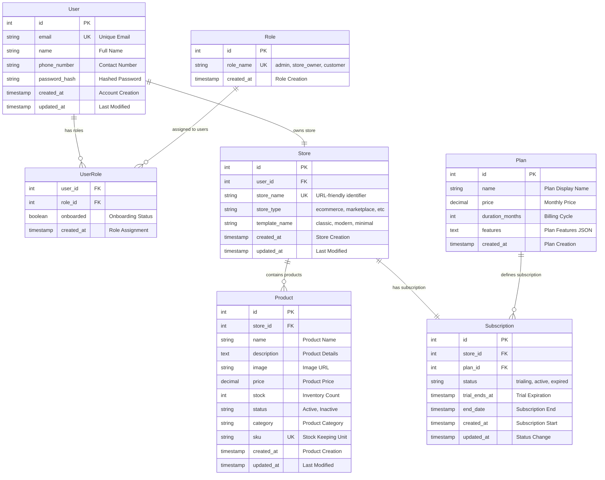
```mermaid
erDiagram
    User {
        int id PK
        string email UK "Unique Email"
        string name "Full Name"
        string phone_number "Contact Number"
        string password_hash "Hashed Password"
        timestamp created_at "Account Creation"
        timestamp updated_at "Last Modified"
    }

    Role {
        int id PK
        string role_name UK "admin, store_owner, customer"
        timestamp created_at "Role Creation"
    }

    UserRole {
        int user_id FK
        int role_id FK
        boolean onboarded "Onboarding Status"
        timestamp created_at "Role Assignment"
    }

    Store {
        int id PK
        int user_id FK
        string store_name UK "URL-friendly identifier"
        string store_type "ecommerce, marketplace, etc"
        string template_name "classic, modern, minimal"
        timestamp created_at "Store Creation"
        timestamp updated_at "Last Modified"
    }

    Product {
        int id PK
        int store_id FK
        string name "Product Name"
        text description "Product Details"
        string image "Image URL"
        decimal price "Product Price"
        int stock "Inventory Count"
        string status "Active, Inactive"
        string category "Product Category"
        string sku UK "Stock Keeping Unit"
        timestamp created_at "Product Creation"
        timestamp updated_at "Last Modified"
    }

    Subscription {
        int id PK
        int store_id FK
        int plan_id FK
        string status "trialing, active, expired"
        timestamp trial_ends_at "Trial Expiration"
        timestamp end_date "Subscription End"
        timestamp created_at "Subscription Start"
        timestamp updated_at "Status Change"
    }

    Plan {
        int id PK
        string name "Plan Display Name"
        decimal price "Monthly Price"
        int duration_months "Billing Cycle"
        text features "Plan Features JSON"
        timestamp created_at "Plan Creation"
    }

    %% Relationships
    User ||--o{ UserRole : "has roles"
    Role ||--o{ UserRole : "assigned to users"
    User ||--|| Store : "owns store"
    Store ||--o{ Product : "contains products"
    Store ||--|| Subscription : "has subscription"
    Plan ||--o{ Subscription : "defines subscription"
```

### Database Indexes Visualization

```mermaid
graph LR
    subgraph "Primary Indexes"
        PK_Users[users.id - PRIMARY]
        PK_Stores[stores.id - PRIMARY]
        PK_Products[products.id - PRIMARY]
        PK_Subscriptions[subscriptions.id - PRIMARY]
    end

    subgraph "Unique Indexes"
        UK_Email[users.email - UNIQUE]
        UK_StoreName[stores.store_name - UNIQUE]
        UK_SKU[products.sku - UNIQUE]
        UK_RoleName[roles.role_name - UNIQUE]
    end

    subgraph "Foreign Key Indexes"
        FK_StoreUser[stores.user_id]
        FK_ProductStore[products.store_id]
        FK_SubStore[subscriptions.store_id]
        FK_SubPlan[subscriptions.plan_id]
    end

    subgraph "Search Indexes"
        IDX_ProductName[products.name - GIN]
        IDX_ProductCategory[products.category]
        IDX_ProductStatus[products.status]
        IDX_StoreTemplate[stores.template_name]
    end

    subgraph "Performance Indexes"
        IDX_SubStatus[subscriptions.status]
        IDX_TrialEnds[subscriptions.trial_ends_at]
        IDX_SubEndDate[subscriptions.end_date]
        COMP_StoreStatus[products(store_id, status)]
    end
```

## 🔄 API Flow Diagrams

### Complete API Request Flow

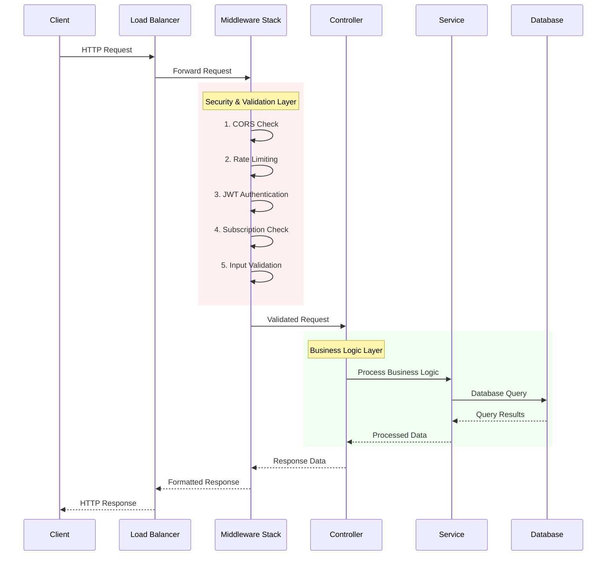
```mermaid
sequenceDiagram
    participant C as Client
    participant LB as Load Balancer
    participant MW as Middleware Stack
    participant Ctrl as Controller
    participant Svc as Service
    participant DB as Database

    C->>LB: HTTP Request
    LB->>MW: Forward Request

    rect rgb(255, 240, 240)
        Note over MW: Security & Validation Layer
        MW->>MW: 1. CORS Check
        MW->>MW: 2. Rate Limiting
        MW->>MW: 3. JWT Authentication
        MW->>MW: 4. Subscription Check
        MW->>MW: 5. Input Validation
    end

    MW->>Ctrl: Validated Request

    rect rgb(240, 255, 240)
        Note over Ctrl: Business Logic Layer
        Ctrl->>Svc: Process Business Logic
        Svc->>DB: Database Query
        DB-->>Svc: Query Results
        Svc-->>Ctrl: Processed Data
    end

    Ctrl-->>MW: Response Data
    MW-->>LB: Formatted Response
    LB-->>C: HTTP Response
```

### Product CRUD API Flow

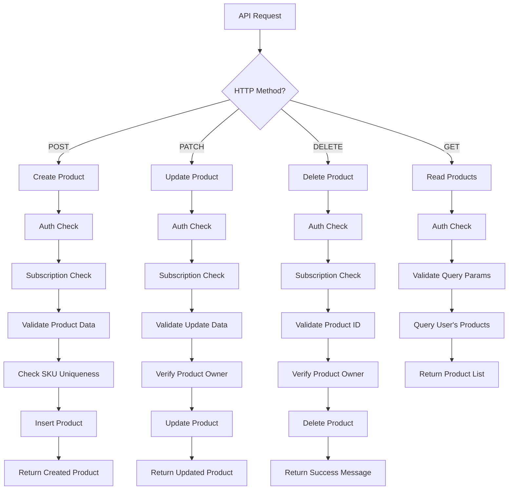
```mermaid
graph TD
    Start[API Request] --> Method{HTTP Method?}

    Method -->|GET| ReadFlow[Read Products]
    Method -->|POST| CreateFlow[Create Product]
    Method -->|PATCH| UpdateFlow[Update Product]
    Method -->|DELETE| DeleteFlow[Delete Product]

    ReadFlow --> AuthCheck1[Auth Check]
    CreateFlow --> AuthCheck2[Auth Check]
    UpdateFlow --> AuthCheck3[Auth Check]
    DeleteFlow --> AuthCheck4[Auth Check]

    AuthCheck2 --> SubCheck1[Subscription Check]
    AuthCheck3 --> SubCheck2[Subscription Check]
    AuthCheck4 --> SubCheck3[Subscription Check]

    AuthCheck1 --> ValidateRead[Validate Query Params]
    SubCheck1 --> ValidateCreate[Validate Product Data]
    SubCheck2 --> ValidateUpdate[Validate Update Data]
    SubCheck3 --> ValidateDelete[Validate Product ID]

    ValidateRead --> QueryDB1[Query User's Products]
    ValidateCreate --> CheckSKU[Check SKU Uniqueness]
    ValidateUpdate --> CheckOwner1[Verify Product Owner]
    ValidateDelete --> CheckOwner2[Verify Product Owner]

    CheckSKU --> CreateDB[Insert Product]
    CheckOwner1 --> UpdateDB[Update Product]
    CheckOwner2 --> DeleteDB[Delete Product]

    QueryDB1 --> Response1[Return Product List]
    CreateDB --> Response2[Return Created Product]
    UpdateDB --> Response3[Return Updated Product]
    DeleteDB --> Response4[Return Success Message]
```

### Public Store Access Flow

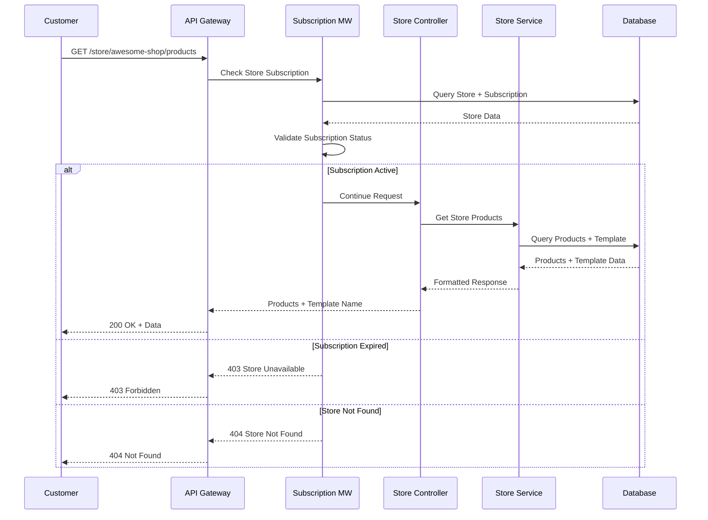
```mermaid
sequenceDiagram
    participant Customer as Customer
    participant API as API Gateway
    participant SubMW as Subscription MW
    participant StoreCtrl as Store Controller
    participant StoreSvc as Store Service
    participant DB as Database

    Customer->>API: GET /store/awesome-shop/products
    API->>SubMW: Check Store Subscription

    SubMW->>DB: Query Store + Subscription
    DB-->>SubMW: Store Data

    SubMW->>SubMW: Validate Subscription Status

    alt Subscription Active
        SubMW->>StoreCtrl: Continue Request
        StoreCtrl->>StoreSvc: Get Store Products
        StoreSvc->>DB: Query Products + Template
        DB-->>StoreSvc: Products + Template Data
        StoreSvc-->>StoreCtrl: Formatted Response
        StoreCtrl-->>API: Products + Template Name
        API-->>Customer: 200 OK + Data
    else Subscription Expired
        SubMW-->>API: 403 Store Unavailable
        API-->>Customer: 403 Forbidden
    else Store Not Found
        SubMW-->>API: 404 Store Not Found
        API-->>Customer: 404 Not Found
    end
```

## 🔐 Authentication Flow

### JWT Authentication Process

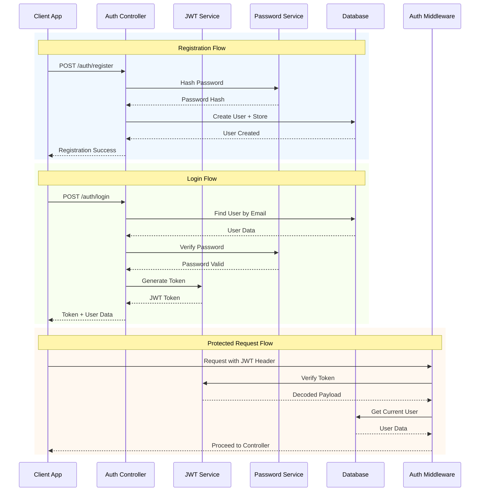
```mermaid
sequenceDiagram
    participant Client as Client App
    participant Auth as Auth Controller
    participant JWT as JWT Service
    participant Hash as Password Service
    participant DB as Database
    participant MW as Auth Middleware

    rect rgb(240, 248, 255)
        Note over Client,DB: Registration Flow
        Client->>Auth: POST /auth/register
        Auth->>Hash: Hash Password
        Hash-->>Auth: Password Hash
        Auth->>DB: Create User + Store
        DB-->>Auth: User Created
        Auth-->>Client: Registration Success
    end

    rect rgb(248, 255, 240)
        Note over Client,DB: Login Flow
        Client->>Auth: POST /auth/login
        Auth->>DB: Find User by Email
        DB-->>Auth: User Data
        Auth->>Hash: Verify Password
        Hash-->>Auth: Password Valid
        Auth->>JWT: Generate Token
        JWT-->>Auth: JWT Token
        Auth-->>Client: Token + User Data
    end

    rect rgb(255, 248, 240)
        Note over Client,MW: Protected Request Flow
        Client->>MW: Request with JWT Header
        MW->>JWT: Verify Token
        JWT-->>MW: Decoded Payload
        MW->>DB: Get Current User
        DB-->>MW: User Data
        MW-->>Client: Proceed to Controller
    end
```

### Role-Based Access Control

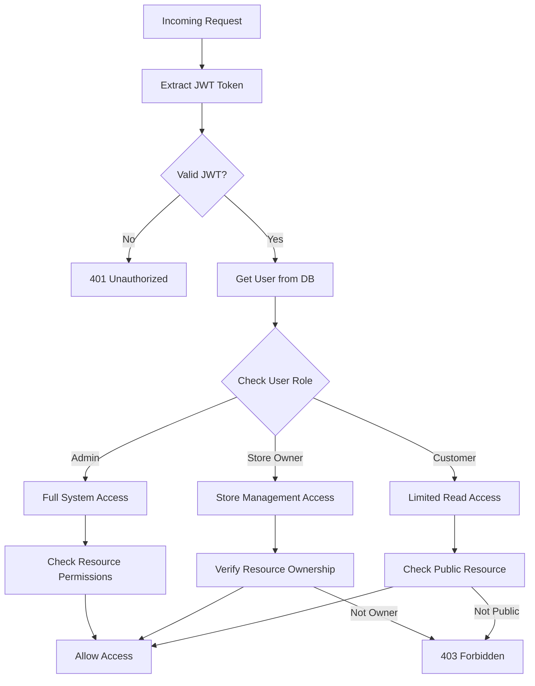
```mermaid
graph TD
    Request[Incoming Request] --> ExtractJWT[Extract JWT Token]
    ExtractJWT --> VerifyJWT{Valid JWT?}

    VerifyJWT -->|No| Unauthorized[401 Unauthorized]
    VerifyJWT -->|Yes| GetUser[Get User from DB]

    GetUser --> CheckRole{Check User Role}

    CheckRole -->|Admin| AdminAccess[Full System Access]
    CheckRole -->|Store Owner| OwnerAccess[Store Management Access]
    CheckRole -->|Customer| CustomerAccess[Limited Read Access]

    AdminAccess --> CheckResource[Check Resource Permissions]
    OwnerAccess --> CheckOwnership[Verify Resource Ownership]
    CustomerAccess --> CheckPublic[Check Public Resource]

    CheckResource --> AllowAccess[Allow Access]
    CheckOwnership --> AllowAccess
    CheckPublic --> AllowAccess

    CheckOwnership -->|Not Owner| Forbidden[403 Forbidden]
    CheckPublic -->|Not Public| Forbidden
```

## 💳 Subscription System Flows

### Subscription Lifecycle Management

```mermaid
stateDiagram-v2
    [*] --> UserRegistration

    UserRegistration --> StoreCreation

    state StoreCreation {
        [*] --> CreateStore
        CreateStore --> CreateTrialSubscription
        CreateTrialSubscription --> TrialActive
    }

    state TrialActive {
        [*] --> ValidTrial
        ValidTrial --> TrialWarning : 2 days left
        TrialWarning --> TrialExpired : 0 days left
        ValidTrial --> PaidSubscription : User Subscribes
    }

    state PaidSubscription {
        [*] --> ActiveSubscription
        ActiveSubscription --> RenewalDue : Near expiry
        RenewalDue --> ActiveSubscription : Auto-renewal
        RenewalDue --> SubscriptionExpired : Payment failed
        ActiveSubscription --> SubscriptionExpired : User cancels
    }

    state TrialExpired {
        [*] --> ReadOnlyAccess
        ReadOnlyAccess --> PaidSubscription : User subscribes
    }

    state SubscriptionExpired {
        [*] --> LimitedAccess
        LimitedAccess --> PaidSubscription : User renews
    }

    TrialExpired --> [*] : Account deletion
    SubscriptionExpired --> [*] : Account deletion
```

### Subscription Validation Middleware Flow

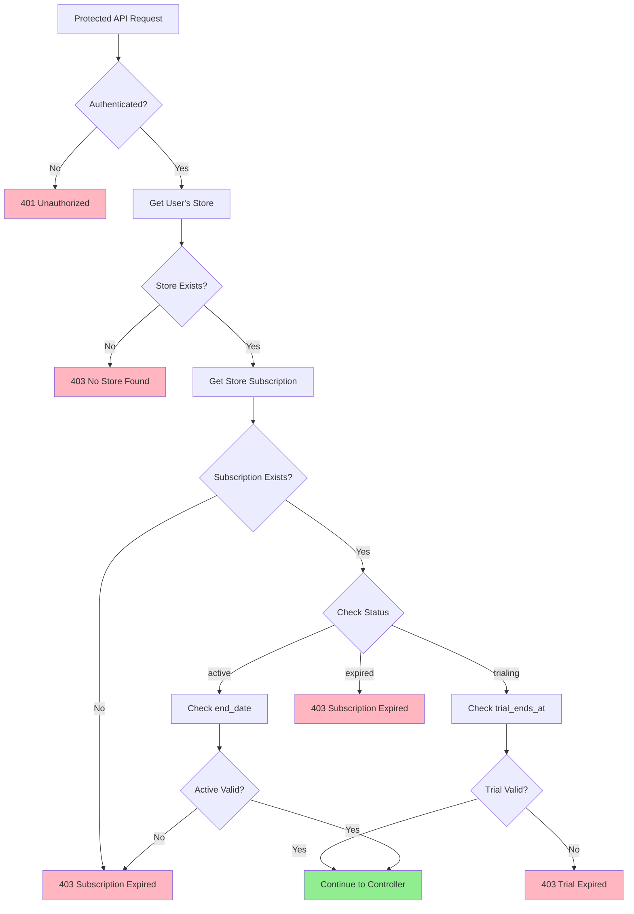
```mermaid
flowchart TD
    Request[Protected API Request] --> AuthCheck{Authenticated?}

    AuthCheck -->|No| Return401[401 Unauthorized]
    AuthCheck -->|Yes| GetUserStore[Get User's Store]

    GetUserStore --> StoreExists{Store Exists?}
    StoreExists -->|No| Return403Store[403 No Store Found]
    StoreExists -->|Yes| GetSubscription[Get Store Subscription]

    GetSubscription --> SubExists{Subscription Exists?}
    SubExists -->|No| Return403Sub[403 No Subscription]
    SubExists -->|Yes| CheckStatus{Check Status}

    CheckStatus -->|trialing| CheckTrial[Check trial_ends_at]
    CheckStatus -->|active| CheckActive[Check end_date]
    CheckStatus -->|expired| Return403Expired[403 Subscription Expired]

    CheckTrial --> TrialValid{Trial Valid?}
    CheckActive --> ActiveValid{Active Valid?}

    TrialValid -->|Yes| AllowAccess[Continue to Controller]
    TrialValid -->|No| Return403Trial[403 Trial Expired]

    ActiveValid -->|Yes| AllowAccess
    ActiveValid -->|No| Return403Sub[403 Subscription Expired]

    style AllowAccess fill:#90EE90
    style Return401 fill:#FFB6C1
    style Return403Store fill:#FFB6C1
    style Return403Sub fill:#FFB6C1
    style Return403Expired fill:#FFB6C1
    style Return403Trial fill:#FFB6C1
```

## 🏢 Multi-Tenant Architecture

### Tenant Data Isolation

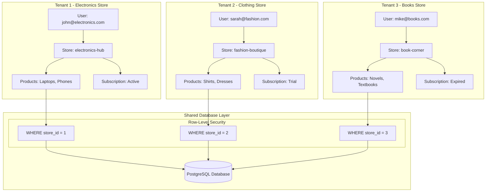
```mermaid
graph TB
    subgraph "Tenant 1 - Electronics Store"
        U1[User: john@electronics.com]
        S1[Store: electronics-hub]
        P1[Products: Laptops, Phones]
        SUB1[Subscription: Active]
    end

    subgraph "Tenant 2 - Clothing Store"
        U2[User: sarah@fashion.com]
        S2[Store: fashion-boutique]
        P2[Products: Shirts, Dresses]
        SUB2[Subscription: Trial]
    end

    subgraph "Tenant 3 - Books Store"
        U3[User: mike@books.com]
        S3[Store: book-corner]
        P3[Products: Novels, Textbooks]
        SUB3[Subscription: Expired]
    end

    subgraph "Shared Database Layer"
        DB[(PostgreSQL Database)]

        subgraph "Row-Level Security"
            RLS1[WHERE store_id = 1]
            RLS2[WHERE store_id = 2]
            RLS3[WHERE store_id = 3]
        end
    end

    U1 --> S1
    S1 --> P1
    S1 --> SUB1

    U2 --> S2
    S2 --> P2
    S2 --> SUB2

    U3 --> S3
    S3 --> P3
    S3 --> SUB3

    P1 --> RLS1
    P2 --> RLS2
    P3 --> RLS3

    RLS1 --> DB
    RLS2 --> DB
    RLS3 --> DB
```

### Multi-Tenant Query Pattern

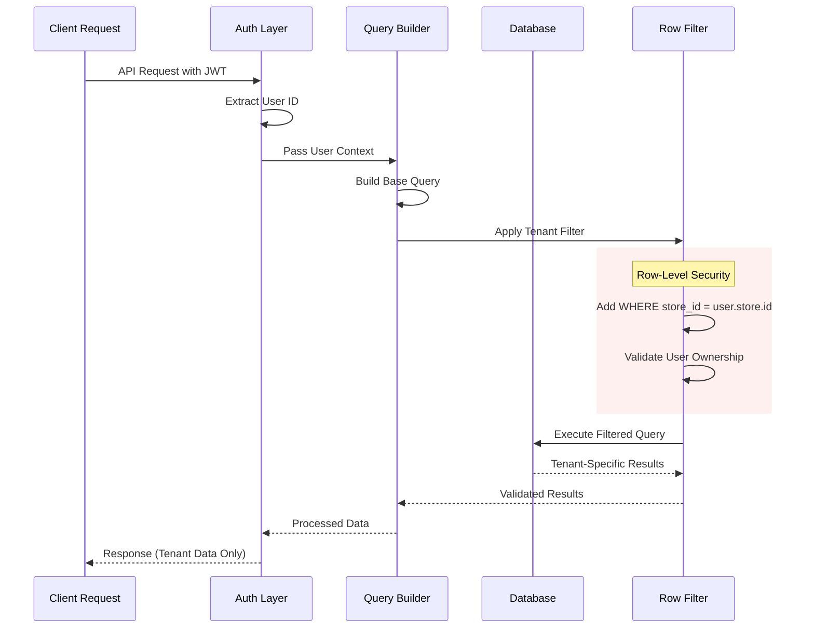
```mermaid
sequenceDiagram
    participant Client as Client Request
    participant Auth as Auth Layer
    participant Query as Query Builder
    participant DB as Database
    participant Filter as Row Filter

    Client->>Auth: API Request with JWT
    Auth->>Auth: Extract User ID
    Auth->>Query: Pass User Context

    Query->>Query: Build Base Query
    Query->>Filter: Apply Tenant Filter

    rect rgb(255, 240, 240)
        Note over Filter: Row-Level Security
        Filter->>Filter: Add WHERE store_id = user.store.id
        Filter->>Filter: Validate User Ownership
    end

    Filter->>DB: Execute Filtered Query
    DB-->>Filter: Tenant-Specific Results
    Filter-->>Query: Validated Results
    Query-->>Auth: Processed Data
    Auth-->>Client: Response (Tenant Data Only)
```

## 🚀 Deployment Architectures

### Production Deployment Architecture

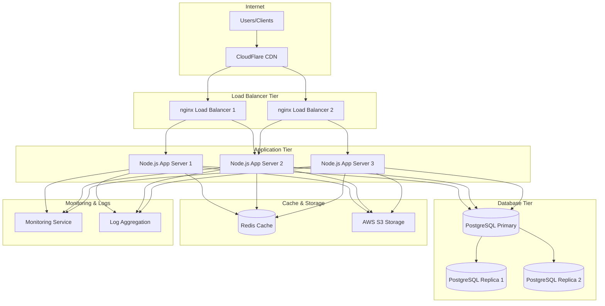
```mermaid
graph TB
    subgraph "Internet"
        Users[Users/Clients]
        CDN[CloudFlare CDN]
    end

    subgraph "Load Balancer Tier"
        LB1[nginx Load Balancer 1]
        LB2[nginx Load Balancer 2]
    end

    subgraph "Application Tier"
        APP1[Node.js App Server 1]
        APP2[Node.js App Server 2]
        APP3[Node.js App Server 3]
    end

    subgraph "Database Tier"
        Primary[(PostgreSQL Primary)]
        Replica1[(PostgreSQL Replica 1)]
        Replica2[(PostgreSQL Replica 2)]
    end

    subgraph "Cache & Storage"
        Redis[(Redis Cache)]
        S3[AWS S3 Storage]
    end

    subgraph "Monitoring & Logs"
        Monitor[Monitoring Service]
        Logs[Log Aggregation]
    end

    Users --> CDN
    CDN --> LB1
    CDN --> LB2

    LB1 --> APP1
    LB1 --> APP2
    LB2 --> APP2
    LB2 --> APP3

    APP1 --> Primary
    APP2 --> Primary
    APP3 --> Primary

    Primary --> Replica1
    Primary --> Replica2

    APP1 --> Redis
    APP2 --> Redis
    APP3 --> Redis

    APP1 --> S3
    APP2 --> S3
    APP3 --> S3

    APP1 --> Monitor
    APP2 --> Monitor
    APP3 --> Monitor

    APP1 --> Logs
    APP2 --> Logs
    APP3 --> Logs
```

### Docker Container Architecture

```mermaid
graph TB
    subgraph "Docker Host"
        subgraph "Application Container"
            NodeApp[Node.js Application]
            PM2[PM2 Process Manager]
        end

        subgraph "Database Container"
            PostgresDB[(PostgreSQL Database)]
            PGData[/var/lib/postgresql/data]
        end

        subgraph "Reverse Proxy Container"
            Nginx[nginx Reverse Proxy]
            SSL[SSL Certificates]
        end

        subgraph "Cache Container"
            RedisCache[(Redis Cache)]
            RedisData[/data]
        end

        subgraph "Shared Volumes"
            AppLogs[/var/log/app]
            Uploads[/uploads]
            Backups[/backups]
        end
    end

    subgraph "External"
        Internet[Internet Traffic]
        Registry[Docker Registry]
    end

    Internet --> Nginx
    Nginx --> NodeApp
    NodeApp --> PostgresDB
    NodeApp --> RedisCache

    NodeApp --> AppLogs
    NodeApp --> Uploads
    PostgresDB --> Backups

    Registry --> NodeApp
    Registry --> PostgresDB
    Registry --> Nginx
    Registry --> RedisCache
```

## 📊 Data Flow Patterns

### Product Management Data Flow

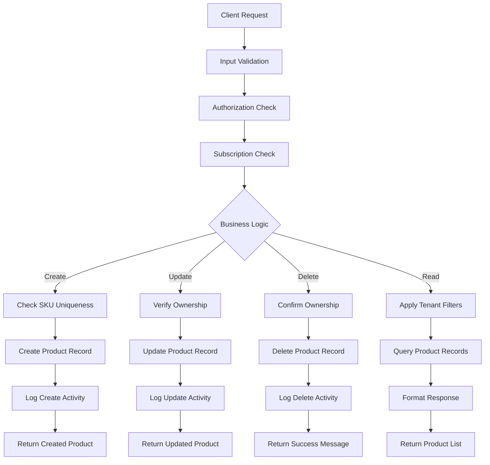
```mermaid
graph TD
    Client[Client Request] --> Validation[Input Validation]
    Validation --> AuthZ[Authorization Check]
    AuthZ --> Subscription[Subscription Check]

    Subscription --> BusinessLogic{Business Logic}

    BusinessLogic -->|Create| ValidateUnique[Check SKU Uniqueness]
    BusinessLogic -->|Update| CheckOwnership[Verify Ownership]
    BusinessLogic -->|Delete| ConfirmOwnership[Confirm Ownership]
    BusinessLogic -->|Read| ApplyFilters[Apply Tenant Filters]

    ValidateUnique --> CreateRecord[Create Product Record]
    CheckOwnership --> UpdateRecord[Update Product Record]
    ConfirmOwnership --> DeleteRecord[Delete Product Record]
    ApplyFilters --> QueryRecords[Query Product Records]

    CreateRecord --> LogActivity1[Log Create Activity]
    UpdateRecord --> LogActivity2[Log Update Activity]
    DeleteRecord --> LogActivity3[Log Delete Activity]
    QueryRecords --> FormatResponse[Format Response]

    LogActivity1 --> Response1[Return Created Product]
    LogActivity2 --> Response2[Return Updated Product]
    LogActivity3 --> Response3[Return Success Message]
    FormatResponse --> Response4[Return Product List]
```

### Store Template Management Flow

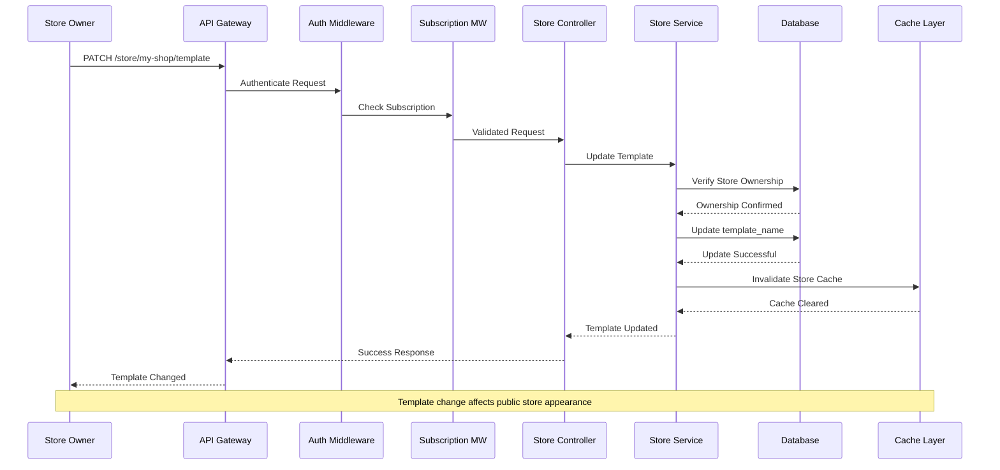
```mermaid
sequenceDiagram
    participant Owner as Store Owner
    participant API as API Gateway
    participant AuthMW as Auth Middleware
    participant SubMW as Subscription MW
    participant StoreCtrl as Store Controller
    participant StoreSvc as Store Service
    participant DB as Database
    participant Cache as Cache Layer

    Owner->>API: PATCH /store/my-shop/template
    API->>AuthMW: Authenticate Request
    AuthMW->>SubMW: Check Subscription
    SubMW->>StoreCtrl: Validated Request

    StoreCtrl->>StoreSvc: Update Template
    StoreSvc->>DB: Verify Store Ownership
    DB-->>StoreSvc: Ownership Confirmed

    StoreSvc->>DB: Update template_name
    DB-->>StoreSvc: Update Successful

    StoreSvc->>Cache: Invalidate Store Cache
    Cache-->>StoreSvc: Cache Cleared

    StoreSvc-->>StoreCtrl: Template Updated
    StoreCtrl-->>API: Success Response
    API-->>Owner: Template Changed

    Note over Owner,Cache: Template change affects public store appearance
```

## ⚠️ Error Handling Flows

### Centralized Error Handling

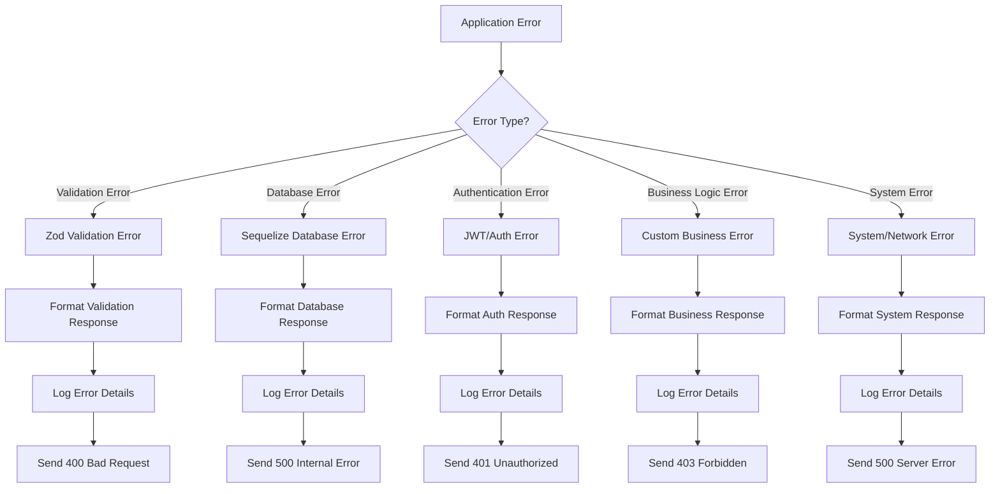
```mermaid
graph TD
    Error[Application Error] --> ErrorType{Error Type?}

    ErrorType -->|Validation Error| ZodError[Zod Validation Error]
    ErrorType -->|Database Error| SequelizeError[Sequelize Database Error]
    ErrorType -->|Authentication Error| AuthError[JWT/Auth Error]
    ErrorType -->|Business Logic Error| BusinessError[Custom Business Error]
    ErrorType -->|System Error| SystemError[System/Network Error]

    ZodError --> FormatZod[Format Validation Response]
    SequelizeError --> FormatDB[Format Database Response]
    AuthError --> FormatAuth[Format Auth Response]
    BusinessError --> FormatBusiness[Format Business Response]
    SystemError --> FormatSystem[Format System Response]

    FormatZod --> LogError1[Log Error Details]
    FormatDB --> LogError2[Log Error Details]
    FormatAuth --> LogError3[Log Error Details]
    FormatBusiness --> LogError4[Log Error Details]
    FormatSystem --> LogError5[Log Error Details]

    LogError1 --> SendResponse1[Send 400 Bad Request]
    LogError2 --> SendResponse2[Send 500 Internal Error]
    LogError3 --> SendResponse3[Send 401 Unauthorized]
    LogError4 --> SendResponse4[Send 403 Forbidden]
    LogError5 --> SendResponse5[Send 500 Server Error]
```

### Subscription Error Flow

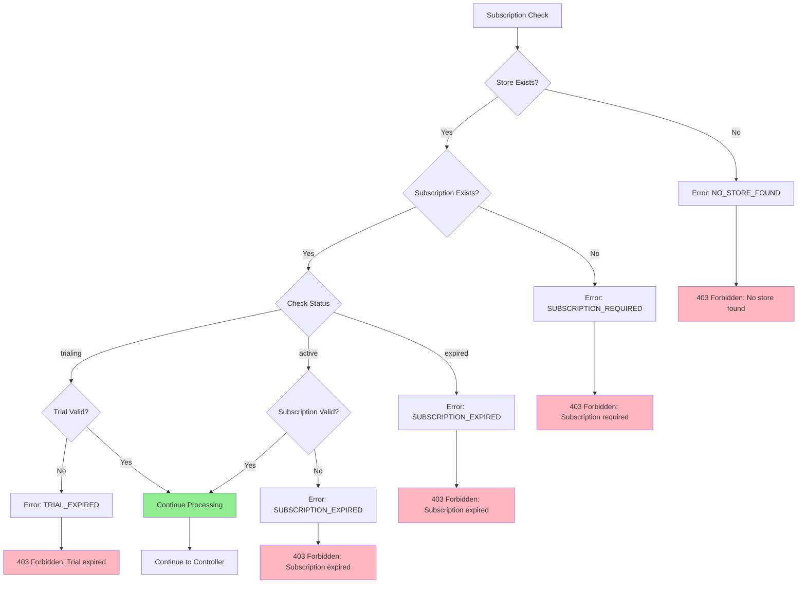
```mermaid
flowchart TD
    SubCheck[Subscription Check] --> HasStore{Store Exists?}

    HasStore -->|No| NoStoreError[Error: NO_STORE_FOUND]
    HasStore -->|Yes| HasSub{Subscription Exists?}

    HasSub -->|No| NoSubError[Error: SUBSCRIPTION_REQUIRED]
    HasSub -->|Yes| CheckStatus{Check Status}

    CheckStatus -->|trialing| CheckTrialDate{Trial Valid?}
    CheckStatus -->|active| CheckSubDate{Subscription Valid?}
    CheckStatus -->|expired| ExpiredError[Error: SUBSCRIPTION_EXPIRED]

    CheckTrialDate -->|No| TrialExpiredError[Error: TRIAL_EXPIRED]
    CheckTrialDate -->|Yes| Success[Continue Processing]

    CheckSubDate -->|No| SubExpiredError[Error: SUBSCRIPTION_EXPIRED]
    CheckSubDate -->|Yes| Success

    NoStoreError --> ErrorResponse1[403 Forbidden: No store found]
    NoSubError --> ErrorResponse2[403 Forbidden: Subscription required]
    ExpiredError --> ErrorResponse3[403 Forbidden: Subscription expired]
    TrialExpiredError --> ErrorResponse4[403 Forbidden: Trial expired]
    SubExpiredError --> ErrorResponse5[403 Forbidden: Subscription expired]

    Success --> Controller[Continue to Controller]

    style Success fill:#90EE90
    style ErrorResponse1 fill:#FFB6C1
    style ErrorResponse2 fill:#FFB6C1
    style ErrorResponse3 fill:#FFB6C1
    style ErrorResponse4 fill:#FFB6C1
    style ErrorResponse5 fill:#FFB6C1
```

---

These visual diagrams provide comprehensive documentation of the UddoktaHut Backend system architecture, data flows, and operational patterns. They serve as both technical documentation and onboarding materials for developers working with the system.
