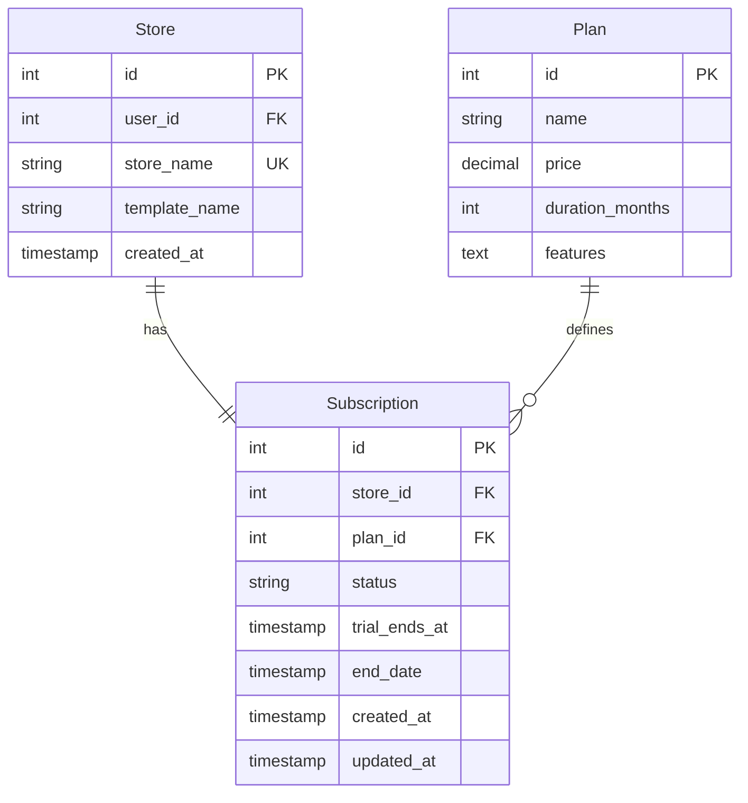
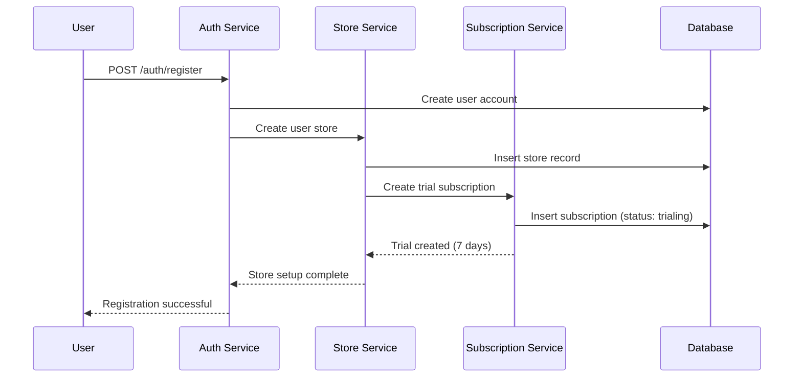
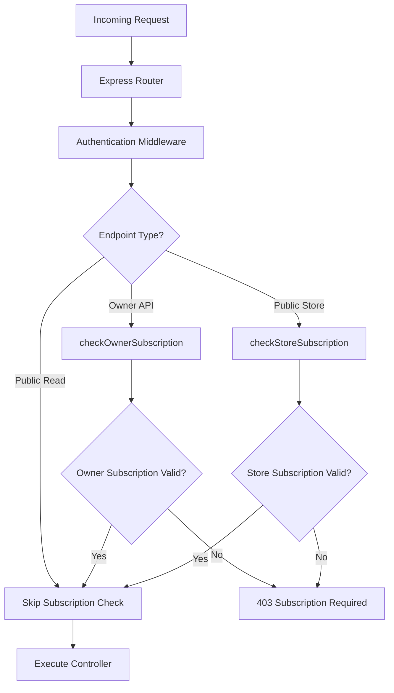
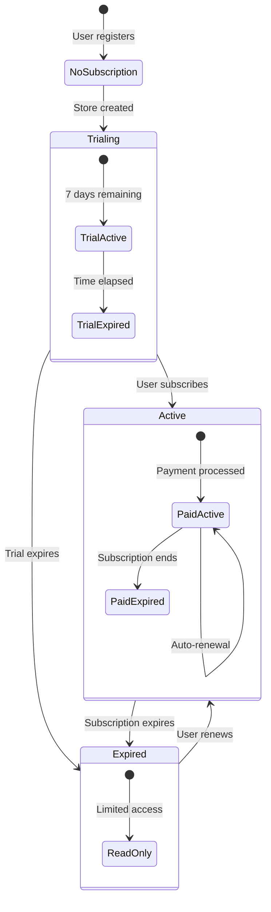

# Subscription System Documentation

This document provides detailed information about the UddoktaHut Backend subscription system, including trial management, middleware implementation, and subscription lifecycle.

## 📋 Table of Contents

- [Overview](#overview)
- [Subscription Model](#subscription-model)
- [Trial Management](#trial-management)
- [Subscription Middleware](#subscription-middleware)
- [Validation Logic](#validation-logic)
- [Subscription Lifecycle](#subscription-lifecycle)
- [Business Rules](#business-rules)
- [Implementation Details](#implementation-details)
- [Testing Scenarios](#testing-scenarios)

## 🎯 Overview

The UddoktaHut subscription system implements a **freemium SaaS model** with:

- **7-day free trial** for new stores
- **Subscription-based access control** for write operations
- **Graceful degradation** for expired subscriptions
- **Multi-tenant isolation** with row-level security

### Key Features

- ✅ Automatic trial activation on store creation
- ✅ Real-time subscription validation
- ✅ Middleware-based access control
- ✅ Trial expiration handling
- ✅ Subscription renewal support
- ✅ Public store access (read-only) regardless of subscription

## 📊 Subscription Model

### Database Schema



### Subscription Status Values

| Status     | Description              | Access Level                    |
| ---------- | ------------------------ | ------------------------------- |
| `trialing` | Active trial period      | Full access until trial_ends_at |
| `active`   | Paid subscription        | Full access until end_date      |
| `expired`  | Trial/subscription ended | Read-only access                |

### Subscription Fields

| Field           | Type      | Purpose                     |
| --------------- | --------- | --------------------------- |
| `store_id`      | INTEGER   | Links to store owner        |
| `plan_id`       | INTEGER   | Subscription plan reference |
| `status`        | VARCHAR   | Current subscription state  |
| `trial_ends_at` | TIMESTAMP | Trial expiration time       |
| `end_date`      | TIMESTAMP | Paid subscription end       |
| `created_at`    | TIMESTAMP | Subscription start time     |

## 🆓 Trial Management

### Trial Creation Flow



### Trial Subscription Creation

```javascript
// Auto-create trial subscription on store creation
const createTrialSubscription = async (storeId) => {
  const trialDuration = 7; // days
  const trialEndsAt = new Date();
  trialEndsAt.setDate(trialEndsAt.getDate() + trialDuration);

  await Subscription.create({
    store_id: storeId,
    plan_id: 1, // Free trial plan
    status: "trialing",
    trial_ends_at: trialEndsAt,
    end_date: null,
  });
};
```

### Trial Expiration Handling

```javascript
// Check if trial is still valid
const isTrialValid = (subscription) => {
  if (subscription.status !== "trialing") return false;

  const now = new Date();
  const trialEnd = new Date(subscription.trial_ends_at);

  return trialEnd > now;
};
```

## 🛡️ Subscription Middleware

### Middleware Architecture



### Middleware Implementation

#### Owner Subscription Middleware

```javascript
/**
 * Middleware for business owner routes - checks subscription by user_id
 */
const checkOwnerSubscription = async (req, res, next) => {
  try {
    const store = await Store.findOne({
      where: { user_id: req.user.id },
      include: [{ model: Subscription, required: false }],
    });

    const validation = await validateStoreSubscription(store, false);

    if (validation.error) {
      return res.status(validation.status).json({
        message: validation.message,
        code: validation.code,
      });
    }

    next();
  } catch (error) {
    console.error("Owner subscription check error:", error);
    return res.status(500).json({ message: "Error checking subscription" });
  }
};
```

#### Store Subscription Middleware

```javascript
/**
 * Middleware for public store routes - checks subscription by store name
 */
const checkStoreSubscription = async (req, res, next) => {
  try {
    const { storeName } = req.params;

    const store = await Store.findOne({
      where: { store_name: storeName },
      include: [{ model: Subscription, required: false }],
    });

    const validation = await validateStoreSubscription(store, true);

    if (validation.error) {
      return res.status(validation.status).json({
        message: validation.message,
        code: validation.code,
      });
    }

    next();
  } catch (error) {
    console.error("Store subscription check error:", error);
    return res
      .status(500)
      .json({ message: "Error checking store subscription" });
  }
};
```

## ✅ Validation Logic

### Core Validation Function

```javascript
function checkValidity(subscription, now) {
  return (
    (subscription.status === "trialing" &&
      new Date(subscription.trial_ends_at) > now) ||
    (subscription.status === "active" && new Date(subscription.end_date) > now)
  );
}
```

### Shared Validation Service

```javascript
const validateStoreSubscription = async (store, isPublicRoute = false) => {
  // Store exists check
  if (!store) {
    return {
      error: true,
      status: isPublicRoute ? 404 : 403,
      message: isPublicRoute ? "Store not found" : "No store found",
    };
  }

  // Subscription exists check
  if (!store.Subscription) {
    return {
      error: true,
      status: 403,
      message: isPublicRoute
        ? "Store subscription not found."
        : "No subscription found. Please subscribe to continue.",
      code: "SUBSCRIPTION_REQUIRED",
    };
  }

  // Validity check
  const now = new Date();
  const isActive = checkValidity(store.Subscription, now);

  if (!isActive) {
    const isTrialing = store.Subscription.status === "trialing";
    return {
      error: true,
      status: 403,
      message: isPublicRoute
        ? "Store is temporarily unavailable."
        : isTrialing
        ? "Free trial expired. Please subscribe to continue."
        : "Subscription expired. Please renew to continue.",
      code: isTrialing ? "TRIAL_EXPIRED" : "SUBSCRIPTION_EXPIRED",
    };
  }

  return { error: false };
};
```

## 🔄 Subscription Lifecycle

### State Diagram



### Lifecycle Events

#### 1. Trial Start

```javascript
// On user registration/store creation
const startTrial = async (storeId) => {
  const trialDays = 7;
  const trialEndsAt = new Date();
  trialEndsAt.setDate(trialEndsAt.getDate() + trialDays);

  return await Subscription.create({
    store_id: storeId,
    plan_id: 1, // Trial plan
    status: "trialing",
    trial_ends_at: trialEndsAt,
    end_date: null,
  });
};
```

#### 2. Trial to Paid Conversion

```javascript
const convertToPaid = async (subscriptionId, planId) => {
  const plan = await Plan.findByPk(planId);
  const endDate = new Date();
  endDate.setMonth(endDate.getMonth() + plan.duration_months);

  return await Subscription.update(
    {
      plan_id: planId,
      status: "active",
      end_date: endDate,
      trial_ends_at: null,
    },
    {
      where: { id: subscriptionId },
    }
  );
};
```

#### 3. Subscription Renewal

```javascript
const renewSubscription = async (subscriptionId) => {
  const subscription = await Subscription.findByPk(subscriptionId, {
    include: [Plan],
  });

  const newEndDate = new Date(subscription.end_date);
  newEndDate.setMonth(
    newEndDate.getMonth() + subscription.Plan.duration_months
  );

  return await subscription.update({
    status: "active",
    end_date: newEndDate,
  });
};
```

#### 4. Subscription Expiration

```javascript
const expireSubscription = async (subscriptionId) => {
  return await Subscription.update(
    {
      status: "expired",
    },
    {
      where: { id: subscriptionId },
    }
  );
};
```

## 📜 Business Rules

### Access Control Matrix

| User Type   | Subscription Status | Read Access       | Write Access | Store Visibility |
| ----------- | ------------------- | ----------------- | ------------ | ---------------- |
| Store Owner | Active Trial        | ✅ Full           | ✅ Full      | ✅ Public        |
| Store Owner | Active Paid         | ✅ Full           | ✅ Full      | ✅ Public        |
| Store Owner | Expired             | ✅ Full           | ❌ Blocked   | ❌ Private       |
| Public User | Store Active        | ✅ Store Products | ❌ N/A       | ✅ Public        |
| Public User | Store Expired       | ❌ Blocked        | ❌ N/A       | ❌ Private       |

### Operation Restrictions

#### Write Operations (Subscription Required)

- ✅ `POST /products` - Create product
- ✅ `PATCH /products/:id` - Update product
- ✅ `DELETE /products/:id` - Delete product
- ✅ `PATCH /store/:storeName/template` - Update template

#### Read Operations (Always Allowed)

- ✅ `GET /products` - Owner's products
- ✅ `GET /subscription/status` - Subscription info
- ✅ `GET /auth/me` - User profile

#### Public Operations (Store Subscription Required)

- ✅ `GET /store/:storeName` - Store info
- ✅ `GET /store/:storeName/products` - Public products

### Error Messages by Context

```javascript
const getErrorMessage = (context, subscriptionStatus) => {
  if (context === "owner") {
    switch (subscriptionStatus) {
      case "no_subscription":
        return "No subscription found. Please subscribe to continue.";
      case "trial_expired":
        return "Free trial expired. Please subscribe to continue.";
      case "subscription_expired":
        return "Subscription expired. Please renew to continue.";
    }
  } else if (context === "public") {
    return "Store is temporarily unavailable.";
  }
};
```

## 🔧 Implementation Details

### Route Protection Examples

#### Protected Owner Routes

```javascript
// Product management routes
router.post("/", authenticateUser, checkOwnerSubscription, createProduct);
router.patch("/:id", authenticateUser, checkOwnerSubscription, updateProduct);
router.delete("/:id", authenticateUser, checkOwnerSubscription, deleteProduct);

// Store template route
router.patch(
  "/:storeName/template",
  authenticateUser,
  checkOwnerSubscription,
  updateTemplate
);
```

#### Public Store Routes

```javascript
// Public store routes (require active store subscription)
router.get("/:storeName", checkStoreSubscription, getStore);
router.get("/:storeName/products", checkStoreSubscription, getStoreProducts);
```

#### Unprotected Routes

```javascript
// Always accessible routes
router.get("/", authenticateUser, getAllProducts);
router.get("/subscription/status", authenticateUser, getSubscriptionStatus);
```

### Database Queries

#### Get Subscription with Store

```javascript
const getStoreWithSubscription = async (userId) => {
  return await Store.findOne({
    where: { user_id: userId },
    include: [
      {
        model: Subscription,
        include: [Plan],
        required: false,
      },
    ],
  });
};
```

#### Check Store Subscription by Name

```javascript
const checkStoreSubscription = async (storeName) => {
  return await Store.findOne({
    where: { store_name: storeName },
    include: [
      {
        model: Subscription,
        required: false,
      },
    ],
  });
};
```

## 🧪 Testing Scenarios

### Test Case 1: New User Trial

```javascript
describe("New User Trial", () => {
  it("should create trial subscription on registration", async () => {
    const user = await createUser();
    const store = await getStoreByUserId(user.id);
    const subscription = await getSubscriptionByStoreId(store.id);

    expect(subscription.status).toBe("trialing");
    expect(subscription.trial_ends_at).toBeTruthy();
    expect(isTrialValid(subscription)).toBe(true);
  });
});
```

### Test Case 2: Trial Expiration

```javascript
describe("Trial Expiration", () => {
  it("should block write operations after trial expires", async () => {
    const user = await createUserWithExpiredTrial();
    const response = await request(app)
      .post("/api/products")
      .set("Authorization", `Bearer ${user.token}`)
      .send(productData);

    expect(response.status).toBe(403);
    expect(response.body.code).toBe("TRIAL_EXPIRED");
  });
});
```

### Test Case 3: Public Store Access

```javascript
describe("Public Store Access", () => {
  it("should allow public access to active stores", async () => {
    const store = await createStoreWithActiveSubscription();
    const response = await request(app).get(
      `/api/store/${store.store_name}/products`
    );

    expect(response.status).toBe(200);
    expect(response.body.data.templateName).toBeTruthy();
  });

  it("should block public access to expired stores", async () => {
    const store = await createStoreWithExpiredSubscription();
    const response = await request(app).get(
      `/api/store/${store.store_name}/products`
    );

    expect(response.status).toBe(403);
    expect(response.body.code).toBe("SUBSCRIPTION_EXPIRED");
  });
});
```

### Test Case 4: Subscription Upgrade

```javascript
describe("Subscription Upgrade", () => {
  it("should allow write operations after upgrade", async () => {
    const user = await createUserWithExpiredTrial();
    await upgradeSubscription(user.store.id, "premium");

    const response = await request(app)
      .post("/api/products")
      .set("Authorization", `Bearer ${user.token}`)
      .send(productData);

    expect(response.status).toBe(201);
  });
});
```

## 🚀 Performance Optimizations

### Subscription Caching

```javascript
// Cache subscription status to reduce database queries
const subscriptionCache = new Map();

const getCachedSubscription = async (storeId) => {
  if (subscriptionCache.has(storeId)) {
    return subscriptionCache.get(storeId);
  }

  const subscription = await getSubscription(storeId);
  subscriptionCache.set(storeId, subscription, { ttl: 300 }); // 5 minutes
  return subscription;
};
```

### Batch Subscription Checks

```javascript
// Check multiple subscriptions in single query
const checkMultipleStores = async (storeIds) => {
  return await Store.findAll({
    where: { id: { [Op.in]: storeIds } },
    include: [{ model: Subscription, required: false }],
  });
};
```

---

This subscription system provides a robust foundation for SaaS billing with trial management, access control, and graceful handling of subscription states.
